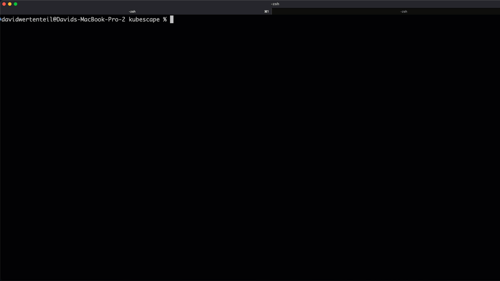
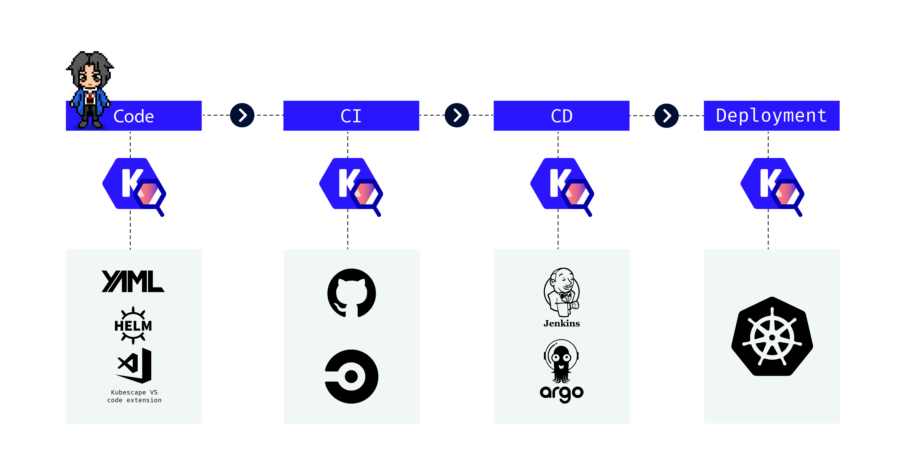
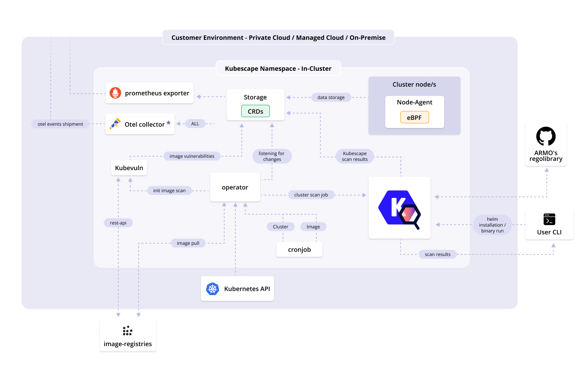

# Kubescape

<picture>
  <source media="(prefers-color-scheme: dark)" srcset="https://raw.githubusercontent.com/cncf/artwork/master/projects/kubescape/stacked/white/kubescape-stacked-white.svg" width="150">
  <source media="(prefers-color-scheme: light)" srcset="https://raw.githubusercontent.com/cncf/artwork/master/projects/kubescape/stacked/color/kubescape-stacked-color.svg" width="150">
  
</picture>

_Comprehensive Kubernetes Security from Development to Runtime_

Kubescape is an open-source Kubernetes security platform that provides comprehensive security coverage, from left to right across the entire development and deployment lifecycle. It offers hardening, posture management, and runtime security capabilities to ensure robust protection for Kubernetes environments. It saves Kubernetes users and admins precious time, effort, and resources.

Kubescape scans clusters, YAML files, and Helm charts. It detects misconfigurations according to multiple frameworks (including [NSA-CISA](https://www.armosec.io/blog/kubernetes-hardening-guidance-summary-by-armo/?utm_source=github&utm_medium=repository), [MITRE ATT&CK®](https://www.armosec.io/glossary/mitre-attck-framework/?utm_source=github&utm_medium=repository) and the [CIS Benchmark](https://www.armosec.io/blog/cis-kubernetes-benchmark-framework-scanning-tools-comparison/?utm_source=github&utm_medium=repository)).


## Demo

Kubescape has a command line tool that you can use to quickly get a report on the security posture of a Kubernetes cluster:



## Getting started

Experimenting with Kubescape is as easy as:

```sh
curl -s https://raw.githubusercontent.com/kubescape/kubescape/master/install.sh | /bin/bash
```

This script will automatically download the latest Kubescape CLI release and scan the Kubernetes cluster in your current kubectl context.

Learn more about:

* [Installing the Kubescape CLI](https://kubescape.io/docs/install-cli/)
* [Running your first scan](https://kubescape.io/docs/scanning/)
* [Accepting risk with exceptions](https://kubescape.io/docs/accepting-risk/)

_Did you know you can use Kubescape in all these places?_

<div align="center">
    
</div>

### Continuous security monitoring with the Kubescape Operator

As well as a CLI, Kubescape provides an in-cluster mode, which is installed via a Helm chart. Kubescape in-cluster provides extensive features such as continuous scanning, image vulnerability scanning, runtime analysis, network policy generation, and more. [Learn more about the Kubescape operator](https://kubescape.io/docs/operator/).

### Using Kubescape as a GitHub Action

Kubescape can be used as a GitHub Action. This is a great way to integrate Kubescape into your CI/CD pipeline. You can find the Kubescape GitHub Action in the [GitHub Action marketplace](https://github.com/marketplace/actions/kubescape).

## Under the hood

Kubescape uses [Open Policy Agent](https://github.com/open-policy-agent/opa) to verify Kubernetes objects against [a library of posture controls](https://github.com/kubescape/regolibrary).
For image scanning, it uses [Grype](https://github.com/anchore/grype).  
For image patching, it uses [Copacetic](https://github.com/project-copacetic/copacetic).
For eBPF, it uses [Inspektor Gadget](https://github.com/inspektor-gadget)

By default, CLI scan results are printed in a console-friendly manner, but they can be:

* exported to JSON, junit XML or SARIF
* rendered to HTML or PDF
* submitted to a [cloud service](docs/providers.md)

### In-cluster architecture 




